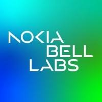

 

**Research Intern** \| Jun 2024 - Sept 2024

Investigating contrastive learning approaches for photoplethysmography signals

---

**Data & AI Graduate Scientist** \| Sept 2019 - Aug 2021 

Rotation 1: Developed a personalized step counting model tailored for various wrist-worn wearable devices, enhancing accuracy in health monitoring.

Rotation 2: Engineered a multi-task deep learning model to predict non-alcoholic fatty liver disease using abdominal MRI data sourced from the UK Biobank, contributing to early diagnosis and treatment strategies.

Rotation 3: Proposed a method for transforming gene expression data into a 2D image format compatible with convolutional neural networks, facilitating new approaches in computational genomics